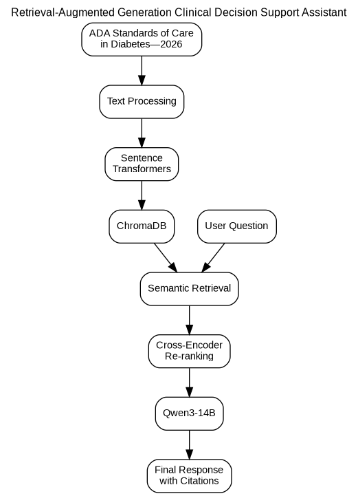

# Clinical Decision Support Assistant Using Retrieval-Augmented Generation (RAG) for Type 2 Diabetes Management

## Project Overview

This project develops a Retrieval-Augmented Generation (RAG) clinical decision support assistant that answers **Type 2 diabetes management** questions using **six sections of the American Diabetes Association (ADA) Standards of Care in Diabetes—2026**.

The project began with a baseline implementation using **Qwen2.5-3B-Instruct** and was later improved by upgrading to **Qwen3-14B** and integrating **Cross-Encoder (MS MARCO MiniLM-L6-v2)** re-ranking to improve retrieval quality before answer generation.

The system retrieves relevant guideline passages from a ChromaDB vector database and generates grounded responses with source citations. The final system was evaluated using quantitative retrieval metrics, citation evaluation, manual assessment of answer quality, and qualitative analysis.

## System Architecture

The overall workflow of the RAG system is shown below.

<p align="center">
  
</p>

---

## Features

- Retrieval-Augmented Generation (RAG)
- Knowledge base built from selected ADA Standards of Care in Diabetes—2026 sections
- Semantic retrieval using Sentence Transformer embeddings
- ChromaDB vector database
- Qwen2.5-3B-Instruct baseline language model
- Qwen3-14B improved language model
- Cross-Encoder (MS MARCO MiniLM-L6-v2) re-ranking
- Source-aware retrieval
- Interactive clinical question-answering chatbot
- Grounded answers with source citations

---

## Technologies Used

- Python
- Google Colab
- Jupyter Notebook
- Hugging Face Transformers
- Sentence Transformers
- ChromaDB
- LangChain
- Qwen Models
- Cross-Encoder (MS MARCO MiniLM-L6-v2)

---

## Installation

Clone the repository:

```bash
git clone https://github.com/akwasianing/clinical-decision-support-rag-diabetes.git
cd clinical-decision-support-rag-diabetes
```

Install the required dependencies:

```bash
pip install -r requirements.txt
```

---

## Knowledge Base and Data Files

The knowledge base was constructed from **six sections** of the **American Diabetes Association (ADA) Standards of Care in Diabetes—2026** (*Diabetes Care*, Volume 49, Supplement 1):

- **Section 2:** Diagnosis and Classification of Diabetes
- **Section 4:** Comprehensive Medical Evaluation and Assessment of Comorbidities
- **Section 5:** Facilitating Positive Health Behaviors and Well-being to Improve Health Outcomes
- **Section 6:** Glycemic Goals, Hypoglycemia, and Hyperglycemic Crises
- **Section 9:** Pharmacologic Approaches to Glycemic Treatment
- **Section 10:** Cardiovascular Disease and Risk Management

The ADA guideline PDF documents are **not included** in this repository because they are copyrighted by the American Diabetes Association.

To reproduce this project:

1. Obtain the six ADA guideline PDF sections listed above from the official ADA publication.
2. Launch the notebook in Jupyter Notebook or Google Colab.
3. Upload the six PDF files when prompted.
4. The notebook will automatically extract the text, preprocess the documents, generate embeddings, and build the ChromaDB vector database.

---

## Usage

### Local

```bash
jupyter notebook
```

Open the notebook and run all cells. When prompted, upload the required ADA guideline PDF files.

### Google Colab

Open the notebook in Google Colab and run all cells. When prompted, upload the required ADA guideline PDF files.

---

## Evaluation

The system was evaluated using the following metrics:

- Mean Precision@3
- Hit Rate@3
- Citation Accuracy
- Hallucinated Citation Rate
- Manual evaluation of:
  - Relevance
  - Faithfulness
  - Clarity

---

## Results

The final system achieved the following performance:

- **Mean Precision@3:** Improved from **0.800** to **0.844**
- **Hit Rate@3:** **1.000**
- **Citation Accuracy:** **100%**
- **Hallucinated Citation Rate:** **0%**

These results demonstrate that incorporating Cross-Encoder re-ranking improved retrieval quality while maintaining reliable, evidence-grounded responses.

---

## References

American Diabetes Association Professional Practice Committee. (2026). *Standards of Care in Diabetes—2026*. *Diabetes Care, 49*(Supplement 1). https://doi.org/10.2337/dc26-SINT

---

## Disclaimer

This project was developed for educational and research purposes only. It is **not** intended to replace professional medical advice, diagnosis, or treatment.

---

## Author

**Obed Akwasi Aning**

M.S. Data Science & Analytics  
University of Missouri–Kansas City

GitHub: https://github.com/akwasianing
